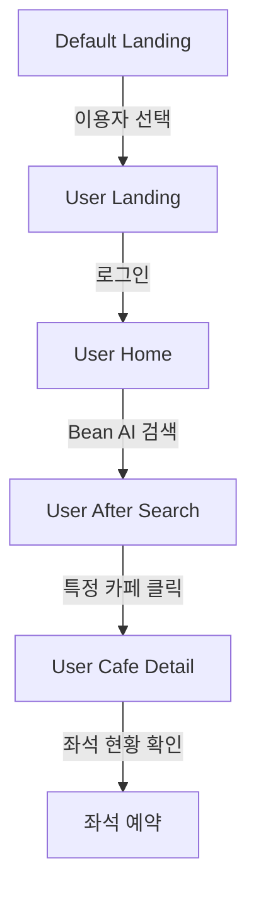

# ☕ Bean - 카페 운영 플랫폼

카페 큐레이팅 서비스 **Bean(빈자리)** 의 프론트엔드 저장소입니다.  
React 기반으로 개발되었으며, Django REST API 백엔드와 연동됩니다.  


## ✨ 주요 기능

### 👩‍💻 점주측 기능
- 회원가입 및 로그인 (JWT 인증 기반)
- 카페 등록 및 좌석 배치도 자동 생성
- 실시간 좌석 상태 업데이트

### 🙋 유저측 기능
- 지도 기반 카페 탐색
- 챗봇 AI로 자연어 기반 카페 검색
- 실시간 좌석 상태 확인
- 빈 좌석 예약


## 🛠️ 기술 스택


## 🚀 실행 방법

### 저장소 클론
```bash
git clone https://github.com/cho58/bean-frontend.git
cd bean-frontend
```

### 패키지 설치
```bash
npm install
```

### 개발 서버 실행
```bash
npm start
```


## 🔗 연동 안내

이 프론트엔드 프로젝트는 백엔드 API 서버 및 모바일 앱과 연동되어 동작합니다.

- **백엔드 저장소 (Django REST API)** → [Bean Backend](https://github.com/ajy121650/beanBack)  
- **모바일 앱 저장소 (React Native / Expo)** → (추가 예정)

> ⚠️ 프론트엔드 실행 시 반드시 백엔드 서버가 실행 중이어야 하며,  
> `.env` 파일의 `VITE_API_URL`을 해당 백엔드 서버 주소로 설정해야 합니다.


## 📁 프로젝트 구조

```
Bean_Front_Clean/
├── public/                      # 정적 파일 (index.html 등)
├── src/
│   ├── apis/                    # API 호출 모듈
│   ├── assets/                  # 이미지, 아이콘 등 정적 자원
│   ├── compo기| E[Cafe SignIn]
    E -->|로그인| F[Cafe Upload]
    F -->|배치도 생성| G[Cafe Map Creating]
    G -->|잠시 대기| H[Cafe Map Created]
    H -->|빈자리 보러가기| I[Cafe Tables Info]
```
---
### 이용자측
---

---


## 📄 라이선스

본 프로젝트의 모든 권리는 프로젝트 팀 **조미유양반김** 에게 있습니다.  
무단 복제 및 배포를 금지합니다.
