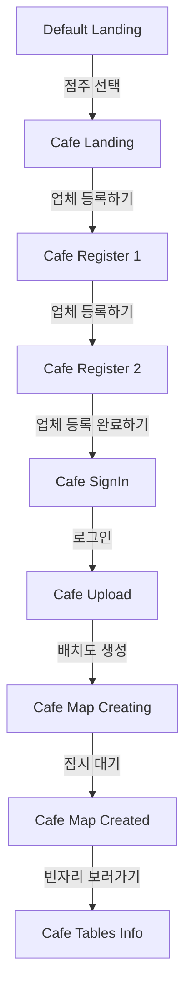
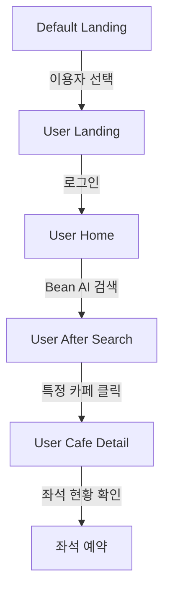

# Bean - 카페 운영 플랫폼

카페 큐레이팅 서비스 **Bean(빈자리)** 의 프론트엔드 저장소입니다.  
React 기반으로 개발되었으며, Django REST API 백엔드와 연동됩니다.  


## 주요 기능

### 점주측 기능
- 회원가입 및 로그인 (JWT 인증 기반)
- 카페 등록 및 좌석 배치도 자동 생성
- 실시간 좌석 상태 업데이트

### 유저측 기능
- 지도 기반 카페 탐색
- 챗봇 AI로 자연어 기반 카페 검색
- 실시간 좌석 상태 확인
- 빈 좌석 예약


## 🛠️ 기술 스택


## 실행 방법

### 저장소 클론
```bash
git clone https://github.com/cho58/bean-frontend.git
cd bean-frontend
```

### 패키지 설치
```bash
npm install
```

### 개발 서버 실행
```bash
npm start
```


## 연동 안내

이 프론트엔드 프로젝트는 백엔드 API 서버 및 모바일 앱과 연동되어 동작합니다.

- **백엔드 저장소 (Django REST API)** → [Bean Backend](https://github.com/ajy121650/beanBack)  
- **모바일 앱 저장소 (React Native / Expo)** → (추가 예정)

> ⚠️ 프론트엔드 실행 시 반드시 백엔드 서버가 실행 중이어야 합니다.


## 프로젝트 구조

```
Bean_Front_Clean/
├── public/                      # 정적 파일 (index.html 등)
├── src/
│   ├── apis/                    # API 호출 모듈
│   ├── assets/                  # 이미지, 아이콘 등 정적 자원
│   ├── components/              # 재사용 가능한 UI 컴포넌트
│   │   ├── RatingTag/           # 별점 태그 컴포넌트
│   │   ├── CafeList.*           # 개별 카페 카드 UI
│   │   ├── ChairDetection.*     # 도면 제작을 위한 의자 요소 감지 컴포넌트
│   │   ├── DetailMap.jsx        # 개별 카페 위치 나타내는 지도 컴포넌트
│   │   ├── Kakaomap.jsx         # 검색된 카페 위치 나타내는 지도 컴포넌트
│   │   ├── MenuDropdown.jsx     # 점주측에서 사용하는 메뉴 드롭다운
│   │   ├── SeatMetaCard.*       # 좌석 정보 기입 컴포넌트
│   │   ├── SeatStartCard.*      # 좌석 점유 설정 컴포넌트
│   │   ├── TableDetection.*     # 도면 제작을 위한 테이블 요소 감지 컴포넌트
│   │   ├── TableMetaCard.jsx    # 테이블 정보 기입 컴포넌트
│   │   ├── TableStatusCard.*    # 의자 점유 상태 나타내는 컴포넌트
│   │   ├── TakenSeat.*          # 점유된 좌석 예약하기 컴포넌트
│   │   ├── UntakenSeat.*        # 비어있는 좌석 예약하기 컴포넌트
│   │   └── UserSearch.*         # 챗봇 초기 검색창 컴포넌트
│   │
│   ├── pages/                   # 주요 라우팅 페이지
│   │   ├── CafeHomeBeanUpdate.* # 빈자리 배치도 만들기 페이지
│   │   ├── CafeLanding.*        # 점주 측 랜딩 페이지
│   │   ├── CafeMapCreated.*     # 도면 제작 완료 페이지
│   │   ├── CafeMapCreating.*    # 도면 제작 중 페이지
│   │   ├── CafeRegister1.*      # 업체 등록 설명 페이지
│   │   ├── CafeRegister2.*      # 회원가입 밎 업체 등록 페이지
│   │   ├── CafeSignIn.*         # 점주 측 로그인 페이지
│   │   ├── CafeTableInfo.*      # 테이블 정보 수정 페이지
│   │   ├── CafeUpload.jsx       # 배치도 업로드 페이지
│   │   ├── DefaultLanding.*     # 랜딩 페이지
│   │   ├── UserAfterSearch.*    # 챗봇 검색 결과 페이지
│   │   ├── UserCafeDetail.*     # 유저측 카페 상세 페이지
│   │   ├── UserHome.*           # 지도 및 챗봇 페이지
│   │   └── UserLanding.*        # 유저측 첫 페이지
│   │
│   ├── utils/                   # 유틸 함수 모음
│   ├── App.js                   # 앱 엔트리 / 라우터 설정
│   ├── index.js                 # React DOM 엔트리
│   └── index.css                # 글로벌 스타일
│
├── package.json                 # 프로젝트 설정 및 의존성
├── package-lock.json
└── README.md
```

## 이용 흐름 시나리오
가장 먼저 뜨는 화면에서 "카페를 찾는 이용자입니다" 버튼을 클릭하면 User Side 화면으로, "카페를 운영하는 점주입니다" 버튼을 클릭하면 Cafe Side 화면으로 이동합니다.

먼저 "카페를 운영하는 점주입니다" 버튼을 클릭해서 Cafe Side로 이동합니다.
"로그인" 버튼을 클릭하면 미리 회원가입된 계정으로 로그인 할 수 있습니다(시연에 사용 가능한 테스트 계정 정보는 아이디:test / 비밀번호:test 이며, 해당 테스트 계정은 회원가입까지 되어있고, 빈자리 배치도는 생성하지 않았습니다.)
"업체 등록하기" 버튼을 클릭해서 카페 정보를 입력하면 회원가입을 할 수 있습니다. 회원가입과 동시에 카페가 생성됩니다. 현재는 '카페 이름'과 '카페 주소' 정보만 카페 등록에 사용되도록 구현되어 있으며, '아이디'와 '비밀번호'는 회원가입에 사용됩니다.

회원가입 및 카페 등록을 완료하면 카페의 배치도를 생성할 수 있는 화면(’업체 등록하기’)으로 이동합니다. 이미 회원가입이 완료된 유저의 경우 로그인 버튼을 통해서 해당 화면으로 이동할 수 있습니다.
등록된 '배치도'가 없는 경우 "빈자리 배치도 만들기" 버튼을 클릭하면 매장 사진을 업로드할 수 있는 화면으로 이동합니다. 해당 화면에서 '도면 사진'을 넣을 경우 AI가 도면의 좌석 배치 정보를 추출합니다.(심사 과정에서는 이때 https://drive.google.com/drive/folders/10JJUE6LKu0SAftDZmGWDJ2R6mUV9RQve?usp=sharing 으로 접속하여 해당 드라이브 내에 있는 floorplan_example.png 또는 floorplan_example2.png 중 하나를 업로드하면 됩니다.)

이후에는 AI가 도면으로부터 좌석 정보를 추출하고 생성한 도면을 화면에 띄웁니다. 만약 "로그인" 버튼을 눌렀을 때 해당 계정의 카페 배치도가 등록되어 있는 상태라면 생성된 배치도가 불러집니다.

생성된 배치도 화면에 대해서는 두가지 작업을 할 수 있습니다. 우측상단 "로그아웃" 버튼 옆 "메뉴 드롭다운" 버튼을 클릭하면 "빈자리 관리하기" 또는 "테이블 정보 수정하기"를 할 수 있습니다.

"빈자리 관리하기"를 클릭했을 경우 도면에 있는 좌석 컴포넌트를 클릭할 경우 좌석의 사용여부를 설정할 수 있는 화면이 나옵니다. 좌석의 사용시간을 클릭을 통해 설정하고 "착석 처리하기" 버튼을 누르면 해당 좌석이 사용중 상태로 변경됩니다. 이후에는 "퇴장 처리하기"를 클릭할 수 있는 모달이 나타나고, 몇분 동안 사용하였는지를 확인할 수 있습니다. 해당 모달을 내리기 위해서는 좌석 컴포넌트를 한번 더 클릭하면 됩니다. 만약 "퇴장 처리하기"가 있는 모달에서 "퇴장 처리하기" 버튼을 누르면 좌석 컴포넌트가 원래대로 돌아오면서 실제로 퇴장이 처리됩니다.

"테이블 정보 수정하기"를 클릭했을 경우 도면에 있는 책상 컴포넌트를 클릭했을 때 테이블의 상태를 설정할 수 있는 화면이 나옵니다. 인원수, 형태를 설정하고 "저장" 버튼을 누르면 실제로 테이블 정보가 수정되어 DB에 반영됩니다.

좌석의 사용 여부나 테이블의 상태는 User Side에서 확인할 수 있습니다. 가장 먼저 뜨는 화면에서 "카페를 찾는 이용자입니다" 버튼을 클릭하여 User Side로 이동합니다. 또, "홈으로 이동하기" 버튼을 클릭하면 챗봇을 이용해 카페들을 검색할 수 있는 화면이 나타납니다.

챗봇의 사용법은 2가지가 있습니다. 일반적인 쿼리문을 자연어로 작성해서 해당 쿼리에 맞는 카페를 챗봇이 추천하는 기능과 Cafe Side에서 직접 등록한 카페 정보와 도면 및 좌석 / 테이블 정보를 확인할 수 있는 기능입니다.

먼저 쿼리문을 자연어로 작성해서 해당 쿼리에 맞는 카페를 챗봇이 추천하는 기능을 사용하기 위해서는 "서울대입구에서 케이크 맛집 알려줘", "합정에서 카공하기 좋은 카페 알려줘" 등을 쿼리로 넣어서 검색 버튼을 클릭하면 됩니다. 이때, 맨처음에 "서울대입구", "합정" 등의 지역 이름을 입력하면 그 지역 주변의 카페들이 더 잘 나타납니다. 만약 카페들이 검색될 경우 카페 리스트가 재정렬되어 나타나고, 해당 검색 내용에 대해 충분한 카페 후보가 없을 경우 해당 화면에 아무것도 뜨지 않을 수 있습니다. 하지만 대부분의 쿼리에서 카페들이 잘 등장합니다.

Cafe Side에서 직접 등록한 카페 정보와 도면 및 좌석 / 테이블 정보를 확인하는 기능을 사용하기 위해서는 “test”라고 입력 후 검색 버튼을 클릭하면 됩니다. (""같은 문자열도 없이 오로지 test만 입력하고 클릭하면 됩니다.) 이렇게 검색할 경우 Cafe Side에서 직접 등록한 카페들이 모두 나열됩니다.

이렇게 나열된 카페들에 대해서 카페 하나를 특정해서 클릭할 경우 카페의 상세정보를 확인할 수 있는 페이지가 나타납니다. 여기서 "좌석 현황" 탭을 클릭할 경우 Cafe Side에서 등록한 도면을 확인할 수 있습니다. 만약 일반적인 챗봇으로 검색된 결과에 한해서는 도면정보가 따로 등록되어있지 않기 때문에 "좌석 현황" 버튼을 클릭해도 아무것도 나타나지 않습니다. Cafe Side에서 도면을 직접 등록한 카페의 경우에는 "좌석 현황" 탭을 클릭 했을 때 Cafe Side에서 보였던 도면이 그대로 나타납니다. 해당 도면에서 좌석 컴포넌트를 클릭할 경우 만약 좌석이 사용중일때는 사용시간을 포함한 정보가 담긴 모달이 나타날 것이고, 좌석이 사용중이지 않을 때는 좌석의 정보(dummy data)가 담기고 "예약하기" 버튼이 담긴 모달이 나타납니다. 아직까지 에약기능은 구현되어있지 않기 때문에 "예약하기" 버튼을 눌러도 변화가 생기지는 않습니다.


## 흐름도
### 점주측
---

---
### 이용자측
---

---


## 라이선스

본 프로젝트의 모든 권리는 프로젝트 팀 **조미유양반김** 에게 있습니다.  
무단 복제 및 배포를 금지합니다.


